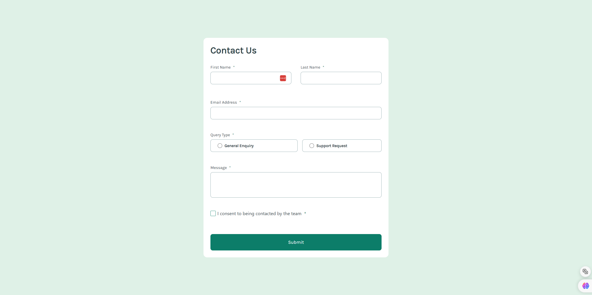

# Frontend Mentor - Contact form solution

This is a solution to the [Contact form challenge on Frontend Mentor](https://www.frontendmentor.io/challenges/contact-form--G-hYlqKJj). Frontend Mentor challenges help you improve your coding skills by building realistic projects. 

## Table of contents

- [Overview](#overview)
  - [The challenge](#the-challenge)
  - [Screenshot](#screenshot)
  - [Links](#links)
- [My process](#my-process)
  - [Built with](#built-with)
  - [What I learned](#what-i-learned)
  - [Continued development](#continued-development)
  - [Useful resources](#useful-resources)
- [Author](#author)


## Overview

### The challenge

Users should be able to:

- Complete the form and see a success toast message upon successful submission
- Receive form validation messages if:
  - A required field has been missed
  - The email address is not formatted correctly
- Complete the form only using their keyboard
- Have inputs, error messages, and the success message announced on their screen reader
- View the optimal layout for the interface depending on their device's screen size
- See hover and focus states for all interactive elements on the page

### Screenshot




### Links

- Solution URL: [Github repository](https://github.com/Robertron624/FCC-contact-form)
- Live Site URL: [Site link](https://main--resonant-fox-729efd.netlify.app/)

## My process

### Built with

- Semantic HTML5 markup
- CSS custom properties
- Flexbox
- CSS Grid
- Mobile-first workflow
- [TypeScript](https://www.typescriptlang.org/) - Superset of JavaScript, adding static typing to the language for better form validation
- [Vite](https://vitejs.dev/) - Frontend build tool


### What I learned

I learned how to create custom checkboxes using pure CSS, it's easier than I thought. I decide not to use any front-end framework for this project, I wanted to challenge myself to create a form from scratch. I also learned how to use TypeScript to validate form data.


- How I created custom checkboxes using pure CSS
```css
form input[type="checkbox"] {
  -webkit-appearance: none;
  appearance: none;
  background-color: var(--white);
  margin: 0;
  font: inherit;
  color: var(--form-control-color);
  width: 1.15em;
  height: 1.15em;
  border: 1.5px solid var(--form-control-color);
  border-radius: 0.15em;
  display: grid;
  place-items: center;
}

input[type="checkbox"]::before {
  content: "";
  width: 100%;
  height: 100%;
  transform: scale(0);
  transition: 120ms transform ease-in-out;
  /* box-shadow: inset 1em 1em var(--form-control-color); */
  background-image: url('/images/icon-checkbox-check.svg');
  background-repeat: no-repeat;
  background-position: center;
}

input[type="checkbox"]:checked::before {
  transform: scale(1);
}
```

- How I used TypeScript to validate form data, this function returns an array of errors if the form data is invalid
```ts
function validateData(data: MyFormData){
    const errors: {field: string, message: string}[] = [];

    const {firstName, lastName, email, queryType, message, consent} = data;
    const requiredMessage = 'This field is required';

    if(!firstName){
        errors.push({
            field: 'firstName',
            message: requiredMessage
        });
    }

    if(!lastName){
        errors.push({
            field: 'lastName',
            message: requiredMessage
        });
    }

    const isSubmittedEmailValid = isValidEmail(email);

    if(!email || !isSubmittedEmailValid){
        errors.push({
            field: 'email',
            message: 'Please enter a valid email address'
        });
    }

    if(!queryType){
        errors.push({
            field: 'queryType',
            message: 'Please select a query type'
        });
    }

    if(!message){
        errors.push({
            field: 'message',
            message: requiredMessage
        });
    }

    if(!consent){
        errors.push({
            field: 'consent',
            message: 'To submit this form, please consent to be contacted'
        });
    }

    return errors;
}
```


### Continued development

I would like to continue to work on my form validation skills. I would also like to work on my pure CSS skills in order to make the form look more like the design. I would also like to work on my TypeScript skills in order to make the form more interactive.

### Useful resources

- [Pure CSS Custom Checkbox Style](https://moderncss.dev/pure-css-custom-checkbox-style/) - This is an amazing article which helped me finally understand how to add custom checkboxes to my form in order to replicate the design. I'd recommend it to anyone still learning this concept.


## Author

- Website - [Robert Ramirez](https://www.robert-ramirez.co)
- Frontend Mentor - [@Robertron624](https://frontendmentor.io/profile/Robertron624)
- Github - [@Robertron624](https://github.com/Robertron624)
